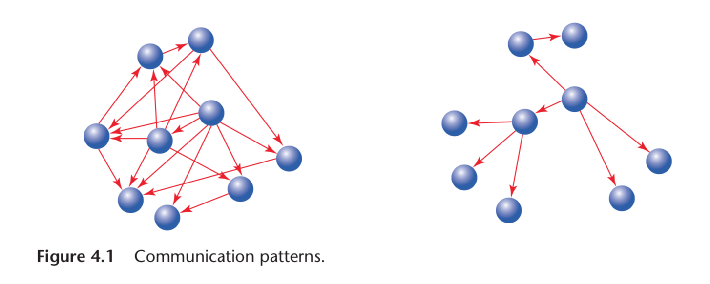
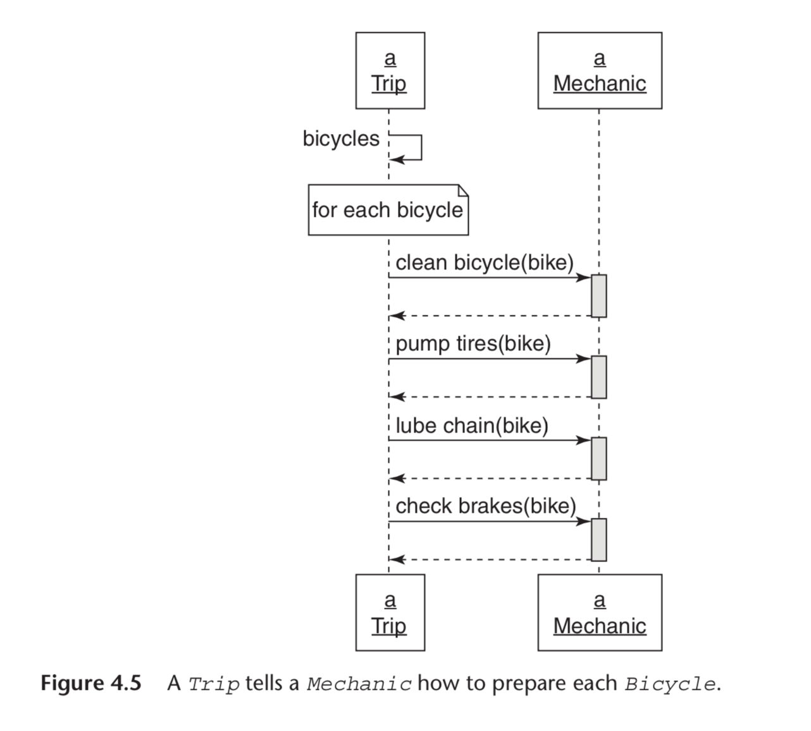
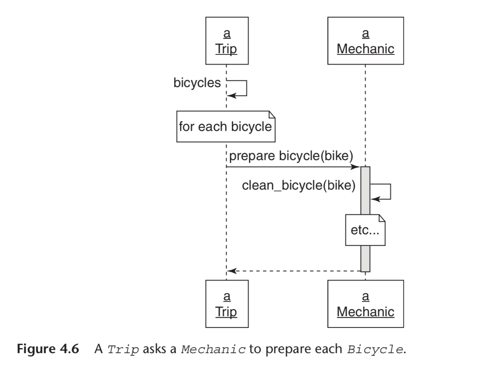

# Creating Flexible Interfaces

> Classes are what you see in your text editor and what you check in to your source code repository. There is design detail that must be captured at this level but an object-oriented application is more than just classes. It is made up of classes but defined by messages. Classes control what’s in your source code repository; messages reflect the living, animated application. Design, therefore, must be concerned with the messages that pass between objects. It deals not only with what objects know (their responsibilities) and who they know (their dependencies), but how they talk to one another. The conversation between objects takes place using their interfaces; this chapter explores creating flexible interfaces that allow applications to grow and to change.

## Understanding Interfaces

In the first application, the messages have no apparent pattern. Every object may send any message to any other object. If the messages left visible trails, these trails would eventually draw a woven mat, with each object connected to every other.

In the second application, the messages have a clearly defined pattern. Here the objects communicate in specific and well-defined ways. If these messages left trails, the trails would accumulate to create a set of islands with occasional bridges between them.

The objects in the first application are difficult to reuse. Each one exposes too much of itself and knows too much about its neighbors. This excess knowledge results in objects that are finely, explicitly, and disastrously tuned to do only the things that they do right now. No object stands alone; to reuse any you need all, to change one thing you must change everything.

The second application is composed of plug-able, component-like objects. Each reveals as little about itself, and knows as little about others, as possible.

The design issue in the first application is not necessarily a failure of dependency injection or single responsibility. Those techniques, while necessary, are not enough to prevent the construction of an application whose design causes you pain. **The roots of this new problem lie not in what each class does but with what it reveals.** In the first application each class reveals all. Every method in any class is fair game to be invoked by any other object.

_Experience tells you that all the methods in a class are not the same; some are more general or more likely to change than others._ The first application takes no notice of this. It allows all methods of any object, regardless of their granularity, to be invoked by others.

In the second application, the message patterns are visibly constrained. This application has some agreement, some bargain, about which messages may pass between its objects. Each object has a clearly defined set of methods that it expects others to use.
These exposed methods comprise the class’s public interface.

## Defining Interfaces

> Each of your classes is like a kitchen. The class exists to fulfill a single responsibility but implements many methods. These methods vary in scale and granularity and range from broad, general methods that expose the main responsibility of the class to tiny utility methods that are only meant to be used internally. Some of these methods represent the menu for your class and should be public; others deal with internal implementation details and are private.

### Public Interfaces

The methods that make up the public interface of your class comprise the face it presents to the world. They:

- Reveal its primary responsibility
- Are expected to be invoked by others
- Will not change on a whim
- Are safe for others to depend on
- Are thoroughly documented in the tests

### Private Interfaces

All other methods in the class are part of its private interface. They:

- Handle implementation details
- Are not expected to be sent by other objects
- Can change for any reason whatsoever
- Are unsafe for others to depend on
- May not even be referenced in the tests

### Responsibilities, Dependencies, and Interfaces

_Creating classes that have a single responsibility—a single purpose._ If you think of a class as having a single purpose, then the things it does (its more specific responsibilities) are what allows it to fulfill that purpose. There is a correspondence between the statements you might make about these more specific responsibilities and the classes’ public methods. Indeed, public methods should read like a description of responsibilities. **The public interface is a contract that articulates the responsibilities of your class.**

_A class should depend only on classes that change less often than it
does._ **The public parts of a class are the stable parts; the private parts are the changeable parts.** When you mark methods as public or private you tell users of your class upon which methods they may safely depend. When your classes use the public methods of others, you trust those methods to be stable. When you decide to depend on the private methods of others, you understand that you are relying on something that is inherently unstable and are thus increasing the risk of being affected by a distant and
unrelated change.

## Finding the Public Interface

Finding and defining public interfaces is an art. The design goal, as always, is to retain maximum future flexibility while writing only enough code to meet today’s requirements. Good public interfaces reduce the cost of unanticipated change; bad public interfaces raise it.

### Constructing an Intention

Whether you are conscious of them or not, you have already formed some intentions of your own. These classes spring to mind because they represent nouns in the application that have both data and behavior. Call them domain objects. They are obvious because they are persistent; they stand for big, visible real-world things that will end up with a representation in your database.

Domain objects are easy to find but they are not at the design center of your application. Instead, they are a trap for the unwary. If you fixate on domain objects you will tend to coerce behavior into them. **Design experts notice domain objects without concentrating on them; they focus not on these objects but on the messages that pass between them. These messages are guides that lead you to discover other objects, ones that are just as necessary but far less obvious.**

Before you sit at the keyboard and start typing you should form an intention about the objects and the messages needed to satisfy this use case. You would be best served if you had a simple, inexpensive communication enhancing way to explore design that did not require you to write code -- _Sequence Diagrams_

### Using Sequence Diagrams

> Sequence diagrams are defined in the Unified Modeling Language (UML) and are one of many diagrams that UML supports.

Sequence diagrams are quite handy. They provide a simple way to experiment with different object arrangements and message passing schemes. _They bring clarity to your thoughts and provide a vehicle to collaborate and communicate with others._ Think of them as a lightweight way to acquire an intention about an interaction. Draw them on a whiteboard, alter them as needed, and erase them when they’ve served their purpose.

Drawing sequence diagram exposes the message passing between the objects and prompts you to ask the question: “Should this receiver be responsible for responding to this message?”

Therein lies the value of sequence diagrams. _They explicitly specify the messages that pass between objects, and because objects should only communicate using public interfaces, sequence diagrams are a vehicle for exposing, experimenting with, and ultimately defining those interfaces._

Also, notice now that you have drawn a sequence diagram, this design conversation has been inverted. **The previous design emphasis was on classes and who and what they knew. Suddenly, the conversation has changed; it is now revolving around messages. Instead of deciding on a class and then figuring out its responsibilities, you are now deciding on a message and figuring out where to send it.**

> _This transition from class-based design to message-based design is a turning point in your design career._ The message-based perspective yields more flexible applications than does the class-based perspective. Changing the fundamental design question from “I know I need this class, what should it do?” to **“I need to send this message, who should respond to it?”** is the first step in that direction.

**You don’t send messages because you have objects, you have objects because you send messages.**

### Asking for “What” Instead of Telling “How”

> The distinction between a message that asks for what the sender wants and a message that tells the receiver how to behave may seem subtle but the consequences are significant. Understanding this difference is a key part of creating reusable classes with well-defined public interfaces.

