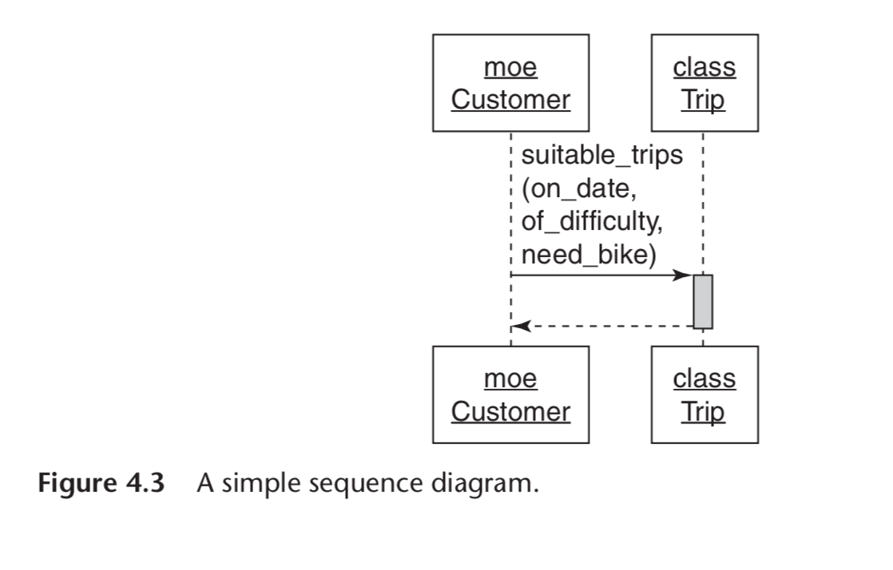
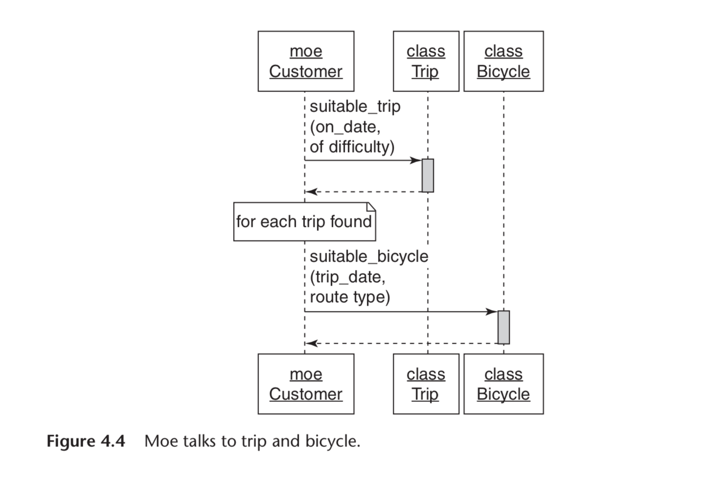
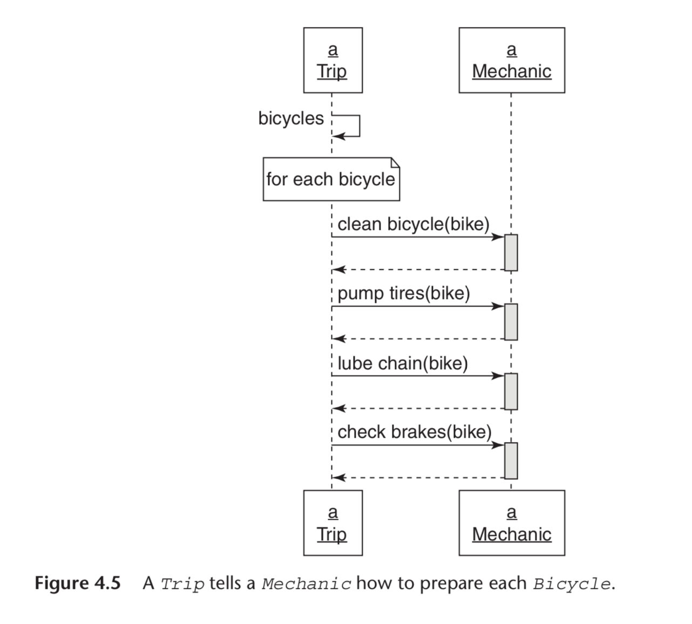
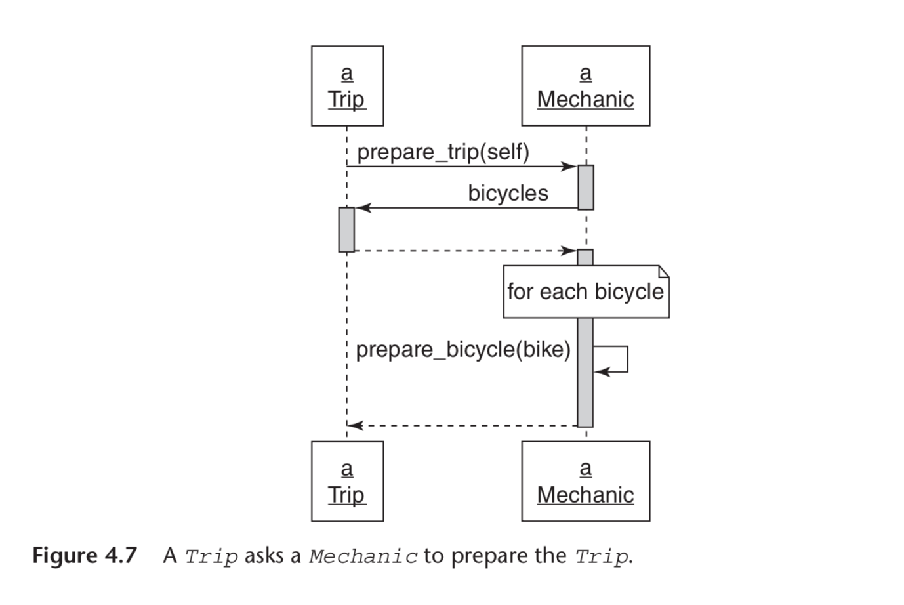
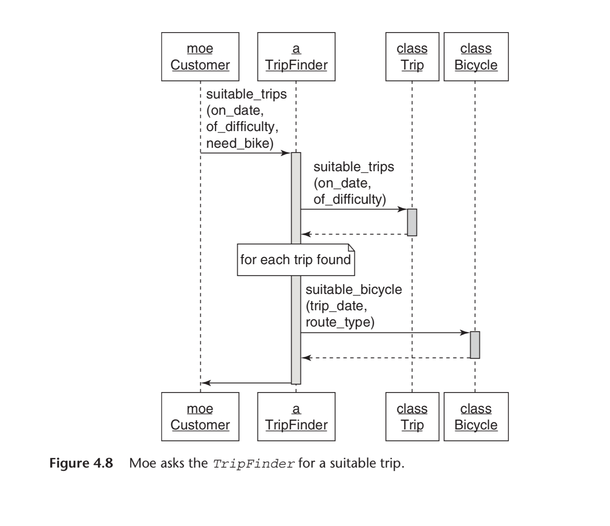

# Creating Flexible Interfaces

> Classes are what you see in your text editor and what you check in to your source code repository. There is design detail that must be captured at this level but an object-oriented application is more than just classes. It is made up of classes but defined by messages. Classes control what’s in your source code repository; messages reflect the living, animated application. Design, therefore, must be concerned with the messages that pass between objects. It deals not only with what objects know (their responsibilities) and who they know (their dependencies), but how they talk to one another. The conversation between objects takes place using their interfaces; this chapter explores creating flexible interfaces that allow applications to grow and to change.

## Understanding Interfaces

In the first application, the messages have no apparent pattern. Every object may send any message to any other object. If the messages left visible trails, these trails would eventually draw a woven mat, with each object connected to every other.

In the second application, the messages have a clearly defined pattern. Here the objects communicate in specific and well-defined ways. If these messages left trails, the trails would accumulate to create a set of islands with occasional bridges between them.

The objects in the first application are difficult to reuse. Each one exposes too much of itself and knows too much about its neighbors. This excess knowledge results in objects that are finely, explicitly, and disastrously tuned to do only the things that they do right now. No object stands alone; to reuse any you need all, to change one thing you must change everything.

The second application is composed of plug-able, component-like objects. Each reveals as little about itself, and knows as little about others, as possible.

The design issue in the first application is not necessarily a failure of dependency injection or single responsibility. Those techniques, while necessary, are not enough to prevent the construction of an application whose design causes you pain. **The roots of this new problem lie not in what each class does but with what it reveals.** In the first application each class reveals all. Every method in any class is fair game to be invoked by any other object.

_Experience tells you that all the methods in a class are not the same; some are more general or more likely to change than others._ The first application takes no notice of this. It allows all methods of any object, regardless of their granularity, to be invoked by others.

In the second application, the message patterns are visibly constrained. This application has some agreement, some bargain, about which messages may pass between its objects. Each object has a clearly defined set of methods that it expects others to use.
These exposed methods comprise the class’s public interface.

## Defining Interfaces

> Each of your classes is like a kitchen. The class exists to fulfill a single responsibility but implements many methods. These methods vary in scale and granularity and range from broad, general methods that expose the main responsibility of the class to tiny utility methods that are only meant to be used internally. Some of these methods represent the menu for your class and should be public; others deal with internal implementation details and are private.

### Public Interfaces

The methods that make up the public interface of your class comprise the face it presents to the world. They:

- Reveal its primary responsibility
- Are expected to be invoked by others
- Will not change on a whim
- Are safe for others to depend on
- Are thoroughly documented in the tests

### Private Interfaces

All other methods in the class are part of its private interface. They:

- Handle implementation details
- Are not expected to be sent by other objects
- Can change for any reason whatsoever
- Are unsafe for others to depend on
- May not even be referenced in the tests

### Responsibilities, Dependencies, and Interfaces

_Creating classes that have a single responsibility—a single purpose._ If you think of a class as having a single purpose, then the things it does (its more specific responsibilities) are what allows it to fulfill that purpose. There is a correspondence between the statements you might make about these more specific responsibilities and the classes’ public methods. Indeed, public methods should read like a description of responsibilities. **The public interface is a contract that articulates the responsibilities of your class.**

_A class should depend only on classes that change less often than it
does._ **The public parts of a class are the stable parts; the private parts are the changeable parts.** When you mark methods as public or private you tell users of your class upon which methods they may safely depend. When your classes use the public methods of others, you trust those methods to be stable. When you decide to depend on the private methods of others, you understand that you are relying on something that is inherently unstable and are thus increasing the risk of being affected by a distant and
unrelated change.

## Finding the Public Interface

Finding and defining public interfaces is an art. The design goal, as always, is to retain maximum future flexibility while writing only enough code to meet today’s requirements. Good public interfaces reduce the cost of unanticipated change; bad public interfaces raise it.

### Constructing an Intention

Whether you are conscious of them or not, you have already formed some intentions of your own. These classes spring to mind because they represent nouns in the application that have both data and behavior. Call them domain objects. They are obvious because they are persistent; they stand for big, visible real-world things that will end up with a representation in your database.

Domain objects are easy to find but they are not at the design center of your application. Instead, they are a trap for the unwary. If you fixate on domain objects you will tend to coerce behavior into them. **Design experts notice domain objects without concentrating on them; they focus not on these objects but on the messages that pass between them. These messages are guides that lead you to discover other objects, ones that are just as necessary but far less obvious.**

Before you sit at the keyboard and start typing you should form an intention about the objects and the messages needed to satisfy this use case. You would be best served if you had a simple, inexpensive communication enhancing way to explore design that did not require you to write code -- _Sequence Diagrams_

### Using Sequence Diagrams

> Sequence diagrams are defined in the Unified Modeling Language (UML) and are one of many diagrams that UML supports.

Sequence diagrams are quite handy. They provide a simple way to experiment with different object arrangements and message passing schemes. _They bring clarity to your thoughts and provide a vehicle to collaborate and communicate with others._ Think of them as a lightweight way to acquire an intention about an interaction. Draw them on a whiteboard, alter them as needed, and erase them when they’ve served their purpose.

Drawing sequence diagram exposes the message passing between the objects and prompts you to ask the question: “Should this receiver be responsible for responding to this message?”

Therein lies the value of sequence diagrams. _They explicitly specify the messages that pass between objects, and because objects should only communicate using public interfaces, sequence diagrams are a vehicle for exposing, experimenting with, and ultimately defining those interfaces._

Also, notice now that you have drawn a sequence diagram, this design conversation has been inverted. **The previous design emphasis was on classes and who and what they knew. Suddenly, the conversation has changed; it is now revolving around messages. Instead of deciding on a class and then figuring out its responsibilities, you are now deciding on a message and figuring out where to send it.**

> _This transition from class-based design to message-based design is a turning point in your design career._ The message-based perspective yields more flexible applications than does the class-based perspective. Changing the fundamental design question from “I know I need this class, what should it do?” to **“I need to send this message, who should respond to it?”** is the first step in that direction.

**You don’t send messages because you have objects, you have objects because you send messages.**

### Asking for “What” Instead of Telling “How”

> The distinction between a message that asks for what the sender wants and a message that tells the receiver how to behave may seem subtle but the consequences are significant. Understanding this difference is a key part of creating reusable classes with well-defined public interfaces.

### Seeking Context Independence

The context that an object expects has a direct effect on how difficult it is to reuse. Objects that have a simple context are easy to use and easy to test; they expect few things from their surroundings. Objects that have a complicated context are hard to use and hard to test; they require complicated setup before they can do anything.

The best possible situation is for an object to be completely independent of its context. An object that could collaborate with others without knowing who they are or what they do could be reused in novel and unanticipated ways.

Context is a coat that Trip wears everywhere; any use of Trip, be it for testing or otherwise, requires that its context be established. Preparing a trip always requires preparing bicycles and in doing so Trip always sends the prepare_bicycle message to its Mechanic. You cannot reuse Trip unless you provide a Mechanic-like object that can respond to this message.

You already know the technique for collaborating with others without knowing who they are—_dependency injection_. The new problem here is for Trip to invoke the correct behavior from Mechanic without knowing what Mechanic does. Trip wants to collaborate with Mechanic while maintaining context independence.

At first glance this seems impossible. Trips have bicycles, bicycles must be prepared, and mechanics prepare bicycles. Having Trip ask Mechanic to prepare a Bicycle seems inevitable.

However, it is not. The solution to this problem lies in the distinction between what and how, and arriving at a solution requires concentrating on what Trip wants.

What Trip wants is to be prepared. The knowledge that it must be prepared is completely and legitimately within the realm of Trip’s responsibilities. However, the fact that bicycles need to be prepared may belong to the province of Mechanic. The need for bicycle preparation is more how a Trip gets prepared than what a Trip wants.

Figure illustrates a third alternative sequence diagram for Trip preparation. In this example, Trip merely tells Mechanic what it wants, that is, to be prepared, and passes itself along as an argument.

In this sequence diagram, Trip knows nothing about Mechanic but still manages to collaborate with it to get bicycles ready. Trip tells Mechanic what it wants, passes self along as an argument, and Mechanic immediately calls back to Trip to get the list of the Bicycles that need preparing.

In the Figure:

- ThepublicinterfaceforTripincludesbicycles.
- The public interface for Mechanic includes prepare_trip and perhaps prepare_bicycle.
- Trip expects to be holding onto an object that can respond to prepare_trip.
- Mechanic expects the argument passed along with prepare_trip to respond to bicycles.

All of the knowledge about how mechanics prepare trips is now isolated inside of Mechanic and the context of Trip has been reduced. Both of the objects are now easier to change, to test, and to reuse.

### Trusting Other Objects

If objects were human and could describe their own relationships, in Figure 4.5 Trip would be telling Mechanic: “I know what I want and I know how you do it;” in Figure 4.6: “I know what I want and I know what you do” and in Figure 4.7: _“I know what I want and I trust you to do your part.”_

This blind trust is a keystone of object-oriented design. It allows objects to collaborate without binding themselves to context and is necessary in any application that expects to grow and change.

### Using Messages to Discover Objects

Figure 4.3 was a literal translation of this use case, one in which Trip had too much responsibility. Figure 4.4 was an attempt to move the responsibility for finding available bicycles from Trip to Bicycle, but in doing so it placed an obligation on Customer to know far too much about what makes a trip “suitable.”

Neither of these designs is very reusable or tolerant of change. These problems are revealed, inescapably, in the sequence diagrams. Both designs contain a violation of the single responsibility principle. In Figure 4.3, Trip knows too much. In Figure 4.4, Customer knows too much, tells other objects how to behave, and requires too much context.

It is completely reasonable that Customer would send the suitable_trips message. That message repeats in both sequence diagrams because it feels innately cor- rect. It is exactly what Customer wants. **The problem is not with the sender, it is with the receiver. You have not yet identified an object whose responsibility it is to implement this method.**

_This application needs an object to embody the rules at the intersection of Customer, Trip and Bicycle. The suitable_trips method will be part of its public interface._

The realization that you need an as yet undefined object is one that you can arrive at via many routes. The advantage of discovering this missing object via sequence diagrams is that the cost of being wrong is very low and the impediments to changing your mind are extremely few. The sequence diagrams are experimental and will be dis- carded; your lack of attachment to them is a feature. They do not reflect your ultimate design, but instead they create an intention that is the starting point for your design.

Perhaps the application should contain a TripFinder class. Figure 4.8 shows a sequence diagram where a TripFinder is responsible for finding suitable trips.

TripFinder contains all knowledge of what makes a trip suitable. It knows the rules; its job is to do whatever is necessary to respond to this message. It provides a consistent public interface while hiding messy and changeable internal implementation details.

Moving this method into TripFinder makes the behavior available to any other object. In the unknown future perhaps other touring companies will use TripFinder to locate suitable trips via a Web service. Now that this behavior has been extracted from Customer, it can be used, in isolation, by any other object.

## Writing Code That Puts Its Best (Inter)Face Forward

The clarity of your interfaces reveals your design skills and reflects your self-discipline. Because design skills are always improving but never perfected, and because even today’s beautiful design may look ugly in light of tomorrow’s requirement, it is difficult to create perfect interfaces.

This, however, should not deter you from trying. Interfaces evolve and to do so they must first be born. It is more important that a well-defined interface exist than that it be perfect.

_Think_ about interfaces. Create them intentionally. It is your interfaces, more than all of your tests and any of your code, that define your application and determine its future.

### Create Explicit Interfaces

Your goal is to write code that works today, that can easily be reused, and that can be adapted for unexpected use in the future. Other people will invoke your methods; it is your obligation to communicate which ones are dependable.

Every time you create a class, declare its interfaces. Methods in the public
interface should

- Be explicitly identified as such
- Be more about what than how
- Have names that, insofar as you can anticipate, will not change
- Take a hash as an options parameter

Be just as intentional about the private interface; make it inescapably obvious. Tests, because they serve as documentation, can support this endeavor. Either do not test private methods or, if you must, segregate those tests from the tests of public methods. Do not allow your tests to fool others into unintentionally depending on the changeable, private interface.

Ruby provides three relevant keywords: _public, protected, and private_. Use of these keywords serves two distinct purposes. First, they indicate which methods are stable and which are unstable. Second, they control how visible a method is to other parts of your application. These two purposes are very different. Conveying informa- tion that a method is stable or unstable is one thing; attempting to control how others use it is quite another.

---

#### Public, Protected, and Private Keywords

The _private_ keyword denotes the least stable kind of method and provides the most restricted visibility. Private methods must be called with an implicit receiver, or, inversely, may never be called with an explicit receiver.

The *protected *keyword also indicates an unstable method, but one with slightly different visibility restrictions. Protected methods allow explicit receivers as long as the receiver is self or an instance of the same class or subclass of self.

The _public_ keyword indicates that a method is stable; public methods are visible everywhere.

---

The keywords don’t deny access, they just make it a bit harder. Using them sends two messages:

- You believe that you have better information today than programmers will have in the future.
- You believe that those future programmers need to be prevented from accidentally using a method that you currently consider unstable.

### Honor the Public Interface of Others

Do your best to interact with other classes using only their public interfaces. Assume that the authors of those classes were just as intentional as you are now and they are trying desperately, across time and space, to communicate which methods are dependable. The public/private distinctions they made are intended to help you and it’s best to heed them.

If your design forces the use of a private method in another class, first rethink your design. It’s possible that a committed effort will unearth an alternative; you should try very hard to find one.

**A dependency on a private method of an external framework is a form of technical debt. Avoid these dependencies.**

### Exercise Caution When Depending on Private Interfaces

Despite your best efforts you may find that you must depend on a private interface. This is a dangerous dependency that should be isolated using the techniques described in Chapter 3. Even if you cannot avoid using a private method, you can prevent the method from being referenced in many places in your application. Depending on a private interface increases risk; keep this risk to a minimum by isolating the dependency.

### Minimize Context

Construct public interfaces with an eye toward minimizing the context they require from others. **Keep the _what_ versus _how_ distinction in mind; create public methods that allow senders to get what they want without knowing how your class implements its behavior.**

**Conversely, do not succumb to a class that has an ill-defined or absent public interface.** When faced with a situation like that of the Mechanic class in Figure 4.5, do not give up and tell it how to behave by invoking all of its methods. Even if the original author did not define a public interface it is not too late to create one for yourself.

Depending on how often you plan to use this new public interface, it can be a new method that you define and place in the Mechanic class, a new wrapper class that you create and use instead of Mechanic, or a single wrapping method that you place in your own class. **Do what best suits your needs, but create some kind of defined public interface and use it. This reduces your class’s context, making it easier to reuse and simpler to test.**

## The Law of Demeter

Having read about responsibilities, dependencies, and interfaces you are now equipped to explore the Law of Demeter.

**The Law of Demeter (LoD) is a set of coding rules that results in loosely coupled objects.** Loose coupling is nearly always a virtue but is just one component of design and must be balanced against competing needs. Some Demeter violations are harmless, but others expose a failure to correctly identify and define public interfaces.

### Defining Demeter

> Demeter restricts the set of objects to which a method may send messages; it prohibits routing a message to a third object via a second object of a different type. Demeter is often paraphrased as _"only talk to your immediate neigbors"_ or _"use only one dot."_

Imagine that Trip’s depart method contains each of the following lines of code:

    customer.bicycle.wheel.tire
    customer.bicycle.wheel.rotate
    hash.keys.sort.join(', ')

Each line is a message chain containing a number of dots (periods). These chains are colloquially referred to as train wrecks; each method name represents a train car and the dots are the connections between them. These trains are an indication that you might be violating Demeter.

### Consequences of Violations

Chapter 2 stated that code should be transparent, reasonable, usable and exem- plary. Some of the message chains above fail when judged against TRUE:

- If wheel changes tire or rotate, depart may have to change.Trip has nothing to do with wheel yet changes to wheel might force changes in Trip. This unnecessarily raises the cost of change; the code is not reasonable.
- Changing tire or rotate may break something in depart. Because Trip is distant and apparently unrelated, the failure will be completely unexpected. This code is not transparent.
- Trip cannot be reused unless it has access to a customer with a bicycle that has a wheel and a tire. It requires a lot of context and is not easily usable.
- This pattern of messages will be replicated by others, producing more code with similar problems. This style of code, unfortunately, breeds itself. It is not exemplary.

The risk incurred by Demeter violations is low for stable attributes, this may be the most cost-efficient strategy.

This tradeoff is permitted as long as you are not changing the value of the attrib- ute you retrieve. If depart sends customer.bicycle.wheel.tire with the intent of altering the result, it is not just retrieving an attribute, it is implementing behavior that belongs in Wheel. In this case, customer.bicycle.wheel.tire becomes just like customer.bicycle.wheel.rotate; it’s a chain that reaches across many objects to get to distant behavior. The inherent cost of this coding style is high; this violation should be removed.

The third message chain, hash.keys.sort.join is perfectly reasonable and, despite the abundance of dots, may not be a Demeter violation at all. Instead of eval- uating this phrase by counting the “dots,” evaluate it by checking the types of the intermediate objects.

    hash.keys returns an Enumerable
    hash.keys.sort also returns an Enumerable
    hash.keys.sort.join returns a String

By this logic, there is a slight Demeter violation. However, if you can bring yourself to accept that hash.keys.sort.join actually returns an Enumerable of Strings, all of the intermediate objects have the same type and there is no Demeter violation. If you remove the dots from this line of code, your costs may well go up instead of down.

As you can see, Demeter is more subtle than first appears. Its fixed rules are not an end in themselves; like every design principle, it exists in service of your overall goals. Certain “violations” of Demeter reduce your application’s flexibility and main- tainability, while others make perfect sense.

### Avoiding Violations

One common way to remove “train wrecks” from code is to use delegation to avoid the “dots.” In object-oriented terms, to delegate a message is to pass it on to another object, often via a wrapper method. The wrapper method encapsulates, or hides, knowledge that would otherwise be embodied in the message chain.

There are a number of ways to accomplish delegation. Ruby contains delegate.rb and forwardable.rb and the Ruby on Rails framework includes the delegate method. Each of these exists to make it easy for an object to automatically intercept a message sent to self and to instead send it somewhere else.

Delegation is tempting as a solution to the Demeter problem because it removes the visible evidence of violations. This technique is sometimes useful, but beware, it can result in code that obeys the letter of the law while ignoring its spirit. _Using delegation to hide tight coupling is not the same as decoupling the code._

### Listening to Demeter

Demeter is trying to tell you something and it isn’t “use more delegation.”

Message chains like customer.bicycle.wheel.rotate occur when your design thoughts are unduly influenced by objects you already know. Your familiarity with the public interfaces of known objects may lead you to string together long message chains to get at distant behavior.

Reaching across disparate objects to invoke distant behavior is tantamount to saying, “there’s some behavior way over there that I need right here and I know how to go get it.” The code knows not only what it wants (to rotate) but how to navigate through a bunch of intermediate objects to reach the desired behavior. Just as Trip, earlier, knew how Mechanic should prepare a bike and so was tightly coupled to Mechanic, here the depart method knows how to navigate through a series of objects to make a wheel rotate and therefore is tightly coupled to your overall object structure.

This coupling causes all kinds of problems. The most obvious is that it raises the risk that Trip will be forced to change because of an unrelated change some- where in the message chain. However, there’s another problem here that is even more serious.

_When the depart method knows this chain of objects, it binds itself to a very specific implementation and it cannot be reused in any other context. Customers must always have Bicycles, which in turn must have Wheels that rotate._

Consider what this message chain would look like if you had started out by deciding what depart wants from customer. From a message-based point of view, the answer is obvious:

    customer.ride

The ride method of customer hides implementation details from Trip and reduces both its context and its dependencies, significantly improving the design. When FastFeet changes and begins leading hiking trips it’s much easier to generalize from customer.ride to customer.depart or customer.go than to disentangle the ten- tacles of this message chain from your application.

The train wrecks of Demeter violations are clues that there are objects whose public interfaces are lacking. Listening to Demeter means paying attention to your point of view. If you shift to a message-based perspective, the messages you find will become public interfaces in the objects they lead you to discover. However, if you are bound by the shackles of existing domain objects, you’ll end up assembling their exist- ing public interfaces into long message chains and thus will miss the opportunity to find and construct flexible public interfaces.

## Summary

Object-oriented applications are defined by the messages that pass between objects. This message passing takes place along “public” interfaces; well-defined public inter- faces consist of stable methods that expose the responsibilities of their underlying classes and provide maximal benefit at minimal cost.

Focusing on messages reveals objects that might otherwise be overlooked. When messages are trusting and ask for what the sender wants instead of telling the receiver how to behave, objects naturally evolve public interfaces that are flexible and reusable in novel and unexpected ways.
